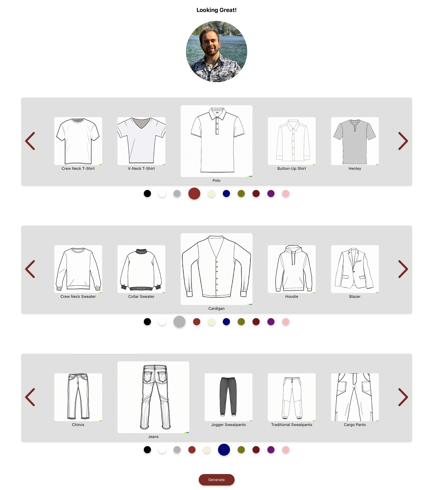

# TOGA

## Project Overview

TOGA is a user-friendly solution to men's fashion essentials and combinations. It saves them from having to spend countless hours browsing clothing stores online and in person. The web app allows men to combine different types of tops, bottoms, and shirts, as well as play around with color palletes.
You can discover new color combos and ways to combine men's fashion essentials such as bombers, jeans, chinos, polos, jackets, hoodies, etc. Just select the clothing type and color for each category and press generate - TOGA will give you an AI generated preview of what your new outfit could look like with your face as the model!

## Technical Overview
The app leverages the Remaker Face Swap API as well as the Open AI API for DALL-E 3 image generation. The user makes a selection of desired clothing and uploads a face picture - this data is then sent to the server. The server is a separate [repository](https://github.com/Be-bo/brainstation-capstone-server) running on an AWS EC2 instance. The server constructs a prompt to generate a generic image of the selected outfit (DALL-E 3) and passes that image to Remaker along with user's face image for face swapping. The result is returned to client and its data stored in a MongoDB instance, on the server. The user can also view the history of all generated images in the Gallery section.
React is used for front-end, SCSS for styling, Redux Toolkit for state management, Axios for REST, MongoDB for storage, Express.js for server-side functionality, and OpenAI API, as well as Remaker API for core functionality. A custom, responsive carousel has also been built for the core Playground feature to make the UX more enjoyable.

### Setup

```
git clone https://github.com/Be-bo/brainstation-capstone.git
```

```
npm install
```

```
npm start
```

### Notes
- SSL setup & hosting is in the works, for now everything is being loaded over HTTP.
- For intended responsive behavior please reload the SPA every time you resize the window significantly.
- A recent server public IP update caused Chrome to start complaining about CORS policy - it's being investigated, in the meantime Safari seems more reliable...
- Each image generation takes at least 15s so be patient. If it's taking longer than 30 seconds, try reloading the app.
- In case of any show-stopping bugs or issues, please email robfiker@gmail.com!


## Screenshots

